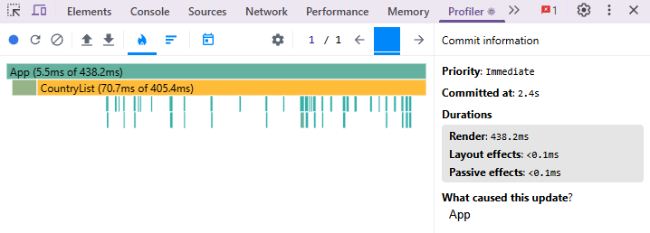
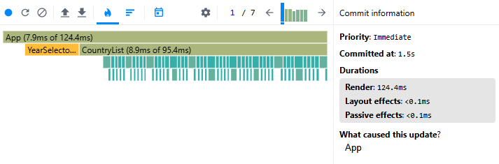
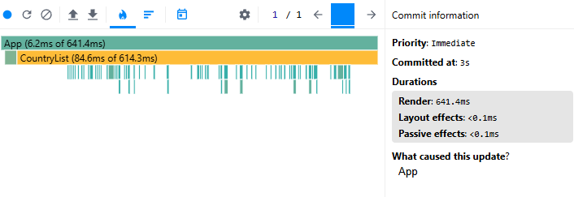
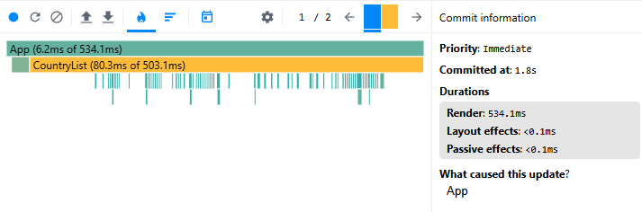
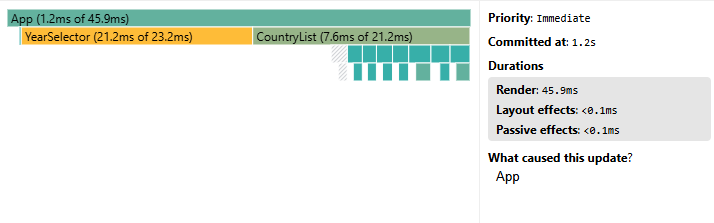
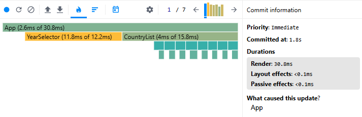
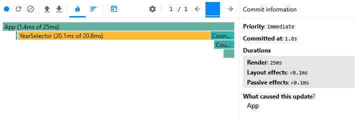
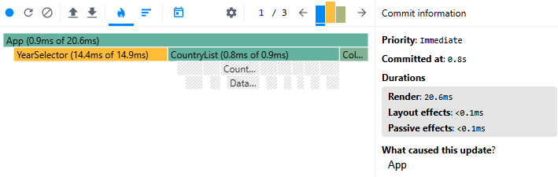

# Performance Optimization Report

## Baseline Measurements

### Interaction A: Sort countries

- **Commit duration**: 0.438 s
- **Render duration**: 438.2 ms
- **Screenshot**: 

### Interaction B: Search countries

- **Commit duration**: 0.124 s
- **Render duration**: 124.4 ms
- **Screenshot**: 

### Interaction C: Change year

- **Commit duration**: 0.641 s
- **Render duration**: 641.1 ms
- **Screenshot**: 

### Interaction D: Toggle column

- **Commit duration**: 0.534 s
- **Render duration**: 534.1 ms
- **Screenshot**: 

## Optimized Measurements

### Interaction A: Sort countries

- **Commit duration**: 0.046 s
- **Render duration**: 45.9 ms
- **Screenshot**: 

### Interaction B: Search countries

- **Commit duration**: 0.031 s
- **Render duration**: 30.8 ms
- **Screenshot**: 

### Interaction C: Change year

- **Commit duration**: 0.025 s
- **Render duration**: 25 ms
- **Screenshot**: 

### Interaction D: Toggle column

- **Commit duration**: 0.021 s
- **Render duration**: 20.6 ms
- **Screenshot**: 

## Summary of Improvements

| Interaction      | Baseline (ms) | Optimized (ms) | Improvement |
| ---------------- | ------------- | -------------- | ----------- |
| Sort countries   | 438.2         | 45.9           | 89.52%      |
| Search countries | 124.4         | 30.8           | 75.24%      |
| Change year      | 641.1         | 25.0           | 96.10%      |
| Toggle column    | 534.1         | 20.6           | 96.14%      |
| **Average**      | **434.45**    | **30.58**      | **92.97%**  |
